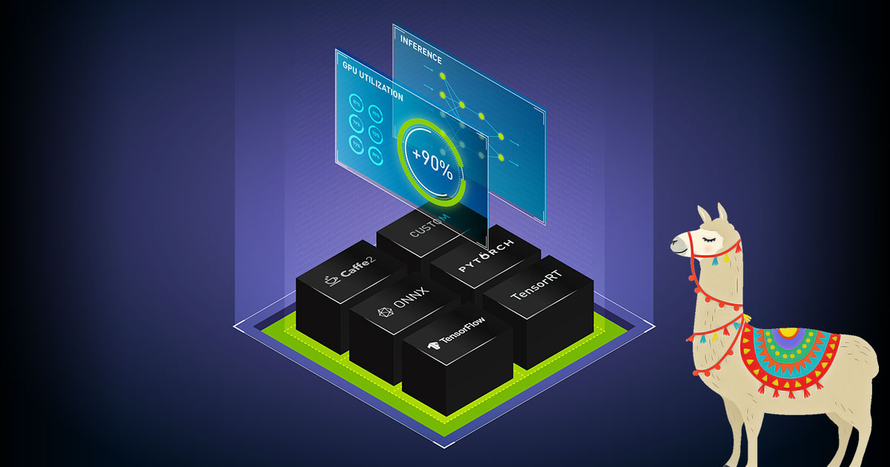

# Deploying Llama2 with NVIDIA Triton Server tutorial

In this repository, we give an example on how to efficiently package and deploy [Llama2](https://ai.meta.com/llama/), using [NVIDIA Triton Inference Server](https://developer.nvidia.com/triton-inference-server) to make it production-ready in no time.

# Features

- Concurrent model execution
- Multi GPU support
- Dynamic Batching  
- vLLM support

# Examples

We cover three different deployment approaches:
- [Using HuggingFace models with Triton’s Python Backend](./python_backend/README.md)
- [Using HuggingFace models with Triton’s Ensemble models](./ensemble_model/README.md)
- [Using the vLLM framework](./vLLM/README.md)
# Results 

- By exploiting Triton’s concurrent model execution feature, we have gained a <b>x1.5 increase</b> in throughput by deploying two parallel instances of the Llama2 7B model quantized to 8 bit. 

    || 
1 instance
 | 
2 instances
| 
    --- | --- | --- |
    Exec time | 
9.79s
 | 
6.72s
 |
    Throughput | 
10.6 token/s
 | 
15.5 token/s
 |

- Implementing dynamic batching added an additional <b>x5 increase</b> in model’s throughout.

    || 
Batch size = 1
 | 
Batch size = 2
| 
    --- | --- | --- |
    Exec time | 
9.79s
 | 
17.07s/center> |
    Throughput | 
10.6 token/s
 | 
66.5 token/s
 |

- The incorporation of the vLLM framework outperformed the dynamic batching results with a <b>x6 increase</b>.

    || 
Batch size = 1
 | 
Batch size = 2
|  
    --- | --- | --- |
    Exec time | 
2.06s
 | 
3.12s
 |
    Throughput | 
50 token/s
 | 
363 token/s
 |

# Documentation

- Deploying Llama2 with NVIDIA Triton Inference Server [blog post](https://blog.marvik.ai/2023/10/05/deploying-llama2-with-nvidia-triton-inference-server/).

- NVIDIA Triton Inference Server Official [documentation](https://docs.nvidia.com/deeplearning/triton-inference-server/user-guide/docs/index.html).
